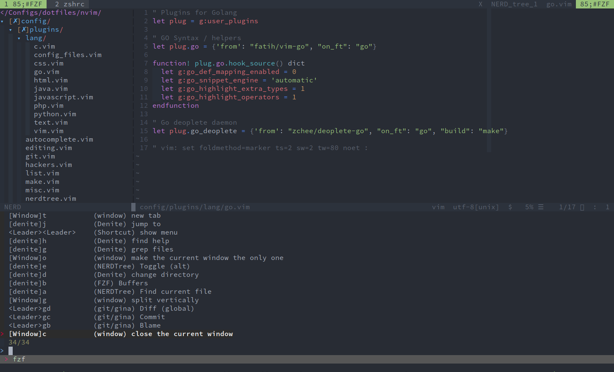

# Niflo's NeoVim Config

My personal NeoVim config scripts, for use as my main IDE.

| :warning: WARNING          |
|:---------------------------|
| This repository is deprecated! |
| Please check out my newer
[dotfiles-lvim](https://github.com/niflostancu/dotfiles-lvim) (LunarVim / LUA-based config framework) instead. |

## Old NeoVim config

Inspired from [rafi's vim config](https://github.com/rafi/vim-config),
[SpaceVim](https://spacevim.org) and many others.

Only tested with [NeoVim](https://neovim.io/) (>= 0.2.2).

## Features

- Fast: uses dein plugin manager and lazy loading;
- Modular: each plugin category has a separate layer file containing the
	plugin's config and mappings;
- Asynchronous plugins: denite, FZF, ALE, deoplete etc.
- Respects the XDG specification, having separate _.config_ and _.cache_ directories.
- Good looking and functional ;) 

## Installation

Simply download the config somewhere on your filesystem.

You can then either use the `install.sh` script (creates a init.vim inside
NeoVim XDG config directory sourcing this one), create a symlink to it or simply
copy all files to `.config/nvim`.

### Recommended tools / linters

- TODO

## Customization

If you want to further personalize this configuration, you can just fork / copy
the source code and start hacking ;)

